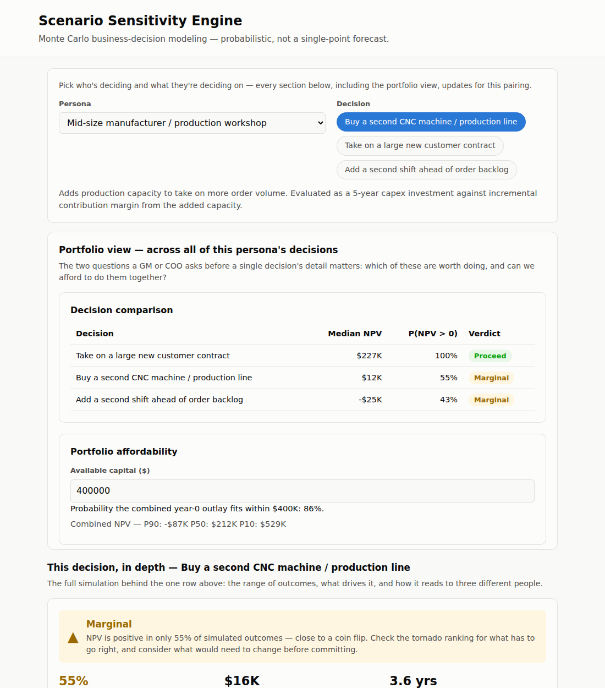

# Scenario Sensitivity Engine

<!-- Replace YOUR-GITHUB-USERNAME once this repo is pushed to GitHub, so the
     CI badge points at the real workflow run. -->
[](https://github.com/YOUR-GITHUB-USERNAME/scenario-sensitivity-engine/actions/workflows/ci.yml)
[](LICENSE)

A Monte Carlo scenario and sensitivity modeling tool for GM/COO-level
business decisions — breakeven, NPV, payback, and tornado-ranked sensitivity,
reported as ranges (P90/P50/P10), not false-precision point estimates.

**Live demo:** _not yet deployed — replace this line with the live URL once
you've deployed via the [Render Blueprint](#deploy-it) below._



> All company names, financial figures, and datasets in this project are
> synthetic and illustrative only — no real business or financial data is
> used or required.

**Status: engine, validation, financing, a second persona, and an interactive
UI are all built** — the engine is covered by a 92-test unit suite, and the
UI by an automated smoke test that drives a real browser (both run in CI on
every push) — extended well past the original scope across
several rounds: tax/depreciation, goal-seek, verdict synthesis,
representative-scenario extraction, cross-decision comparison, and
portfolio-level correlation and affordability; then decision sequencing and a
combined cash-flow calendar, named compound stress scenarios, a
variance-contribution breakdown, ramp-up/commissioning delay modeling,
audience-specific views, and typo protection on driver ids; then a persona
validation layer, debt/interest financing with a DSCR covenant check, a
second fully independent persona (mine-site heavy-equipment services), a
documented AI-assisted/human-verified persona-authoring workflow, CI-enforced
type-checking, and a dependency-free static browser UI (see below). See
`docs/METHODOLOGY.md` for how the engine works.

## Try it

Requires **Node 22.18+, 23.6+, or 24.3+** — the engine and tests run as plain
`.ts` files with zero build step, which depends on Node's native TypeScript
type-stripping being enabled without a flag (it isn't on older Node
versions). Pinned in `package.json`'s `engines` field.

```
node scripts/demo.ts
```

Runs all three decisions for the manufacturer persona and prints, per
decision: base-case NPV, the P90/P50/P10 range, probability of a positive
NPV, a Proceed/Marginal/Reconsider verdict, the tornado sensitivity ranking,
a goal-seek breakeven value for the top driver, a representative year-by-year
cash-flow scenario for each of P90/P50/P10, a variance-contribution
breakdown, and the three audience-specific views (executor/CFO/lender). It
then prints a cross-decision comparison table, a portfolio-affordability
check, a named compound stress scenario, and a sequenced-decision run (the
CNC line feeding the second shift's capacity) with a cash-floor/covenant
check across the combined calendar.

## Use the UI

```
npm run build:web
```

Compiles `src/web/`, `src/engine/`, and `src/personas/` to plain browser ES
modules with `tsc` (no bundler — TypeScript's
`rewriteRelativeImportExtensions` rewrites the `.ts` import extensions used
for Node-native execution to `.js` in the compiled output) and copies
`web/index.html`/`web/styles.css` into `dist/web/`. Open `dist/web/index.html`
in a browser: pick a persona and decision, see the verdict, NPV range and
tornado chart, the variance-contribution breakdown, the three audience views,
a live debt-financing/DSCR panel for capex decisions, and the persona-level
comparison and portfolio-affordability panels. Charts are inline SVG built to
the same validated, colorblind-safe palette and mark spec used throughout,
with no charting library dependency.

## Deploy it

`render.yaml` is a [Render](https://render.com) Blueprint for exactly this:
a free static site, no server, built with `npm ci && npm run build:web` and
served from `dist/web/`. In the Render dashboard: **New → Blueprint**, point
it at this repo, and it reads `render.yaml` automatically — no manual build
settings to configure. `.node-version` pins the Node version Render builds
with, matching the `engines` requirement above. Any other static host
(Netlify, Vercel, GitHub Pages) works the same way: run `npm run build:web`
and publish `dist/web/`.

## Run the tests

```
npm run verify
```

Runs, in order: `tsc --noEmit` against every `.ts` file including the UI
layer; the 92-test engine suite (`node --test`); the browser build
(`npm run build:web`), which type-checks `src/web/` a second time under its
own browser-targeting `tsconfig.web.json` — a different module/lib context
than the Node-targeting typecheck above, so this step exists specifically to
catch a mismatch between the two (see "Caught in review" below); and an
automated UI smoke test (`npm run test:web`) against the built page. All four
steps are enforced in CI on every push/PR (`.github/workflows/ci.yml`).

**First-time setup for the UI smoke test:** it drives a real headless browser
via [Playwright](https://playwright.dev), which needs its browser binary
installed once: `npx playwright install chromium`.

The 92 engine tests cover RNG determinism, statistical property tests on
each distribution (not exact-value asserts — a stochastic engine's output is
random by design), a regression test for a PERT edge case caught in review
(see below), convergence testing, financial-math edge cases, the P90/P10
exceedance convention, tornado-ranking correctness, tax/depreciation
known-value correctness, goal-seek correctness (the solved value is verified
to actually yield ~0 NPV, not just returned), verdict threshold boundaries,
representative-scenario extraction, cross-decision comparison ordering,
portfolio affordability sanity bounds, variance-contribution correctness (a
synthetic driver known to dominate NPV is confirmed to dominate its variance
share), compound stress-scenario matching, sequenced/dependent decision
correctness and reproducibility, covenant/cash-floor threshold counting, the
typo guard (a decision with a deliberately broken driver reference is
confirmed to fail loudly, not silently), the audience-specific views, the
persona validation layer (inverted ranges, negative capex, percent-unit
mistakes, duplicate driver ids all caught and named), debt amortization and
DSCR correctness, loan-terms validation (see "Caught in review" below), and
the second persona (proving the engine is genuinely persona-agnostic — every
cross-decision and portfolio function runs against it with zero engine
changes).

The UI smoke test is deliberately a floor, not a full UI test suite: it
confirms the page's key sections render with no console errors, that
switching persona and decision doesn't break anything, and it
regression-tests the loan-validation bug below directly in a browser.

## What's modeled beyond the base case

- **After-tax cash flows** — every decision routes through straight-line
  depreciation and a sampled effective tax rate, not a pretax figure.
- **Terminal/salvage value** — the capex decision models resale value at the
  end of its horizon, taxed only on the gain over remaining book value.
- **Goal-seek** — for any driver, solve for the value at which NPV hits
  exactly zero, holding everything else at base case.
- **Verdict synthesis** — a Proceed/Marginal/Reconsider label with the
  probability behind it, stated thresholds included.
- **Representative scenarios** — the actual simulated trial nearest each of
  P90/P50/P10, not a statistically incoherent composite of independent
  per-year percentiles.
- **Cross-decision comparison** — every decision run and ranked side by side
  by P50 NPV, verdict included.
- **Shared macro-factor correlation** — a portfolio run couples decisions'
  demand-linked drivers through one shared economic-conditions factor per
  trial, rather than treating every decision as independent when they
  compete for the same budget.
- **Portfolio affordability** — the probability that funding several
  decisions together fits within a stated capital budget.
- **Sequenced/dependent decisions** — one decision's real-world output (e.g.
  added production capacity) can cap another's inputs in the *same*
  simulated trial, on a shared calendar with its own combined cash-flow
  timeline — not just parallel independent or macro-coupled bets.
- **Cash-floor / covenant check** — the lowest cumulative combined cash
  balance reached at any point on that calendar, per trial, and the
  probability it stays above a stated floor — the liquidity question NPV
  alone doesn't answer.
- **Named compound stress scenarios** — filter simulated trials to a named
  combination of pessimistic drivers (not just "a bad P90 year in general")
  and see the NPV distribution and a representative cash flow within that
  specific subset.
- **Variance-contribution breakdown** — what share of the simulated NPV
  spread each driver actually explains once everything is moving at once, as
  distinct from its isolated tornado swing.
- **Ramp-up / commissioning delay** — capex and headcount decisions model a
  delay before full-rate output, reducing (not eliminating) year-1 cash flow
  rather than assuming day-one productivity.
- **Audience-specific views** — the same result rendered as one operational
  line for the person executing the decision, an assumptions-and-variance
  view for a CFO, or a downside/residual-value view for a lender.
- **Typo protection on driver ids** — a `cashFlows` implementation that
  misspells a driver id fails immediately with a clear error, instead of
  silently producing `NaN`.
- **Persona validation** — every persona is checked on import: inverted
  min/max ranges, negative capex, a percent-unit driver outside 0–1,
  duplicate driver ids, and missing rationale all fail loudly and by name,
  not silently at simulation time.
- **Debt financing and a DSCR covenant check** — any capex decision can be
  wrapped with a standard amortizing loan (proceeds added at year 0, debt
  service and the interest tax shield applied each year); `runDscrAnalysis`
  recomputes the loan per trial from that trial's own sampled capex and
  reports the probability the worst-year debt-service coverage ratio stays
  above a stated covenant threshold.
- **A second, independently calibrated persona** — mine-site heavy-equipment
  repair and logistics, built on the same shared engine with zero engine
  changes, proving the driver-based design is genuinely swappable rather
  than tailored to one industry.

See `docs/METHODOLOGY.md` for the reasoning and stated simplifications behind
each of these (particularly the macro-factor approach, which is explicitly
*not* full covariance-matrix correlation modeling, and the
variance-contribution breakdown, which is a correlation-based approximation
rather than a full Sobol decomposition).

## Structure

- `src/engine/` — pure simulation logic: distributions, RNG, Monte Carlo
  runner, financial math, tornado analysis, tax/depreciation, goal-seek,
  verdict synthesis, representative-scenario extraction, portfolio-level
  comparison/correlation/affordability, decision sequencing with a combined
  cash-flow calendar, named compound stress scenarios, variance-contribution
  analysis, audience-specific views, typo protection on driver ids, persona
  validation, and debt financing/DSCR analysis. Zero UI dependencies, fully
  unit-testable in isolation.
- `src/personas/` — typed persona/scenario configs (named drivers, their
  distributions, and the decisions they expose) consumed by the shared
  engine above, registered in `src/personas/index.ts`. Swapping personas
  swaps this config, not the engine code.
- `src/web/` — the UI layer: `main.ts` (app orchestration and DOM wiring) and
  `charts.ts` (inline SVG tornado/range charts). Imports the engine and
  persona modules directly — no separate UI-facing API layer.
- `web/` — the static `index.html`/`styles.css` the compiled UI loads;
  `scripts/build-web.mjs` compiles and assembles them into `dist/web/`.
  `scripts/test-web.mjs` is the automated Playwright smoke test that runs
  against that build.
- `docs/METHODOLOGY.md` — why each distribution was chosen, the sensitivity
  approach, and the output convention.
- `docs/BENCHMARKS.md` — where the input ranges actually come from, for both
  personas.
- `docs/AI_ASSISTED_AUTHORING.md` — the documented process for using an LLM
  to draft a new persona's driver config, gated by mandatory human review and
  the automated validation layer above — not a live API integration.
- `.github/workflows/ci.yml` — runs `npm run typecheck` and `npm test` on
  every push and pull request.

## Caught in review

The first version of `samplePert` used a mean-matching formula that divided
by `(mode - mean)`, which is exactly zero whenever a driver's mode sits at
the midpoint of its range — silently collapsing to a uniform distribution
via a fallback, on this repo's own first persona config. Replaced with the
standard PERT-to-Beta parameterization, which is provably exact for both the
PERT mean and mode with no singularity, and added a regression test
(`test/engine.test.ts`) that would catch this class of bug again. See the
commit history and `docs/METHODOLOGY.md` for the full account.

Stress-testing the finished UI by hand with deliberately invalid inputs
(rather than just the values the number-input's `min`/`max` attributes
suggest) turned up a real one: setting the financing panel's loan term to 0,
or its loan-to-value above 100%, made `runDscrAnalysis` fall through to an
empty amortization schedule and report **a misleadingly confident "100%
probability of meeting the covenant"** instead of an error — and a 0-year
term with a nonzero loan-to-value would have let `financeDecision` add loan
proceeds to year 0 while never modeling any repayment at all. Fixed with an
explicit `validateLoanTerms` check at every entry point that consumes loan
terms, which rejects those states outright instead of computing a
plausible-looking number from them; both are covered by regression tests
(`test/engine.test.ts`) and by the UI smoke test (`scripts/test-web.mjs`),
which fills in the 0-year term specifically to confirm the rejection is
visible to the person using it, not just thrown internally.

Separately: CI's typecheck ran against `tsconfig.json` (Node-targeting,
`types: ["node"]`), which also happens to cover every file under `src/web/`
— but that is a different module/lib context than the browser build actually
ships with (`tsconfig.web.json`, no Node types). A Node-only reference
accidentally introduced into the UI code could type-check clean under the
first and fail the second, and CI never ran the second. `npm run verify` and
CI now both run `npm run build:web` explicitly, closing that gap.

A dedicated UX/information-architecture review pass (deliberately screenshotting
individual panels in isolation, not just the whole page) turned up two more real
CSS bugs and one real structural one, none of which the automated smoke test was
built to catch since none of them break functionality:

- `.panel-row`'s `align-items: flex-end` bottom-aligned the Persona and Decision
  fields, so the shorter Persona field visually floated below empty space
  whenever the Decision tabs wrapped to two lines. Fixed with `flex-start`.
- `.panel-grid` was missing `align-items: start`, so the shorter NPV-range
  chart panel stretched to match the taller tornado-chart panel next to it,
  leaving dead whitespace — the same CSS grid default-stretch bug already
  fixed once for `.audience-grid`, reintroduced in a different grid.
- The page's top-to-bottom order put single-decision mechanics first and the
  cross-decision portfolio view (the comparison table and affordability check)
  dead last — backwards for a reader scanning top-down, since the portfolio
  view is the more decision-relevant content for a GM/COO-level reader.
  Reordered so the portfolio view sits right under the persona/decision
  picker, with the single-decision deep dive below it under its own heading;
  no logic changed, since every element is still found by ID regardless of
  where it sits in the page.

## No backend, no bundler

Everything runs entirely client-side — engine, personas, and UI are all
plain TypeScript with zero runtime dependencies. The UI is a dependency-free
static page rather than a framework app: no React, no build tool beyond
`tsc` itself, deployable as static files with no server.

## About

Built by **Nathan Taylor** — operations and construction leader (GM/COO
background) building out a portfolio of decision-support tools alongside a
job search in South-East Queensland, Australia.
[LinkedIn](https://www.linkedin.com/in/nathan-taylor02)
